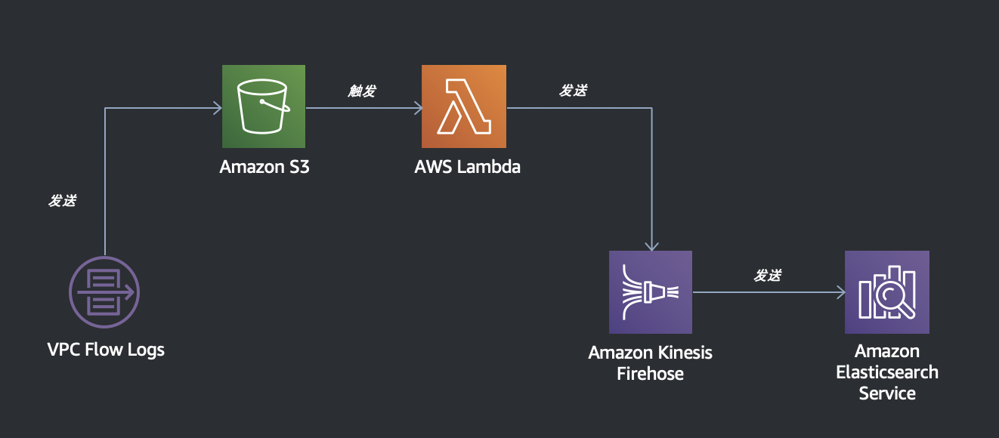

# VPC Flow Logs / CDK 演示

将 VPC Flow Logs 存入 S3，并通过 Firehose 打入 Amazon Elasticsearch Service

## 免责声明

建议测试过程中使用此方案，生产环境使用请自行考虑评估。

当您对方案需要进一步的沟通和反馈后，可以联系 nwcd_labs@nwcdcloud.cn 获得更进一步的支持。

欢迎联系参与方案共建和提交方案需求, 也欢迎在 github 项目 issue 中留言反馈 bugs。

## 项目说明

本项目让用户可以使用 Elasticsearch 来分析 VPC Flow Logs。这个项目提供日志进入 Elasticsearch 的框架，用户可以基于日志数据进行分析和可视化。

在 CloudWatch Logs Insights 未进入 AWS 大陆区域之前，此方法可以帮助用户快速分析和可视化 VPC Flow Logs，识别流量模式和潜在风险。

## 使用方式

### 准备工作

开始安装前，请确保系统已满足如下条件：

- 有 `npm` 或者 `yarn` 工具
- 有 AWS 命令行工具
- 已配置好 AWS 的 Access Key ID 及 Access Secret Key （可运行 `aws configure` 命令来设置）

### 安装依赖

在本目录下运行 `npm install` 或 `yarn install`。

### 运行 CDK

- 使用 `npm run cdk synth` 命令，转译 CDK 模板
- 使用 `npm run cdk deploy` 命令，部署转译好的 CloudFormation 模板

### 开启 Flow Logs

- 在控制台搜索服务 > VPC
- 选择想开启 Flow Logs 的 VPC 或子网
- 创建 Flow Logs，选择 S3 桶作为目标，输入 CloudFormation 创建的桶的 ARN
- 创建会失败，稍等 1-2 分钟后去 CloudTrails > Events History 找到 `PutBucketPolicy`，并复制其中的 `bucketPolicy` 字段（详见微信文章：链接）
- 将复制出的粘贴到前述桶的 Bucket Policy，并修改其中的 `awscn` 为 `aws-cn`
 - 此为绕过 Flow Logs 的一个 Bug
- 重新创建 Flow Logs 即可成功 

### 删除资源

部署成功后，可在 CloudFormation 中看到已经部署的 Stack。实验完成后，记得删除 Stack，避免持续产生费用。

## FAQ

**问：这个演示有什么用？**

答：这个演示主要目的是展示 CDK 的完整使用流程。此外，在中国区没有 CloudWatch Logs Insights 的时候可以作为 Flow Logs 的分析和可视化基础。

**问：如何确认日志是否有打入？**

答：在 Elasticsearch 的 Indices 界面下，可以看到 `flow-logs-2019-01-01` 的索引，点开如果看到 `Count` 大于 1 则意味着有日志已打入。

**问：开启之后为什么没有日志打入？**

答：① 确保 Flow Logs 打入正确的桶，且桶中出现了 Flow Logs 的文件夹；② 确保选择的 VPC 有网络流量；③ 在开启之后稍微等片刻，日志发送会有一定的滞后（数分钟到十数分钟都有可能）。

**问：为什么 Kibana 中没有看到数据？**

答：为确保演示不跑偏，演示内容仅包含数据进入 Kibana，但不包含 Kibana 本身的使用。请关注后续的演示，或参考其他资料对 Kibana 进行配置。在 Elasticsearch > Indices 中可以看到日志的格式，方便配置 Kibana。用户也可以根据自己需要来调整 CDK，基于 Kibana 来做日志分析和可视化，并形成基建代码。

**问：遇到问题如何调试？**

答：这个演示已经考虑到了大部分调试问题并且已在中国区域进行测试，如果仍遇到问题，可在 CloudWatch 中可以看到 Lambda 和 Kinesis 的日志，也可以在 CloudTrail 中看到 API 相关的日志。
